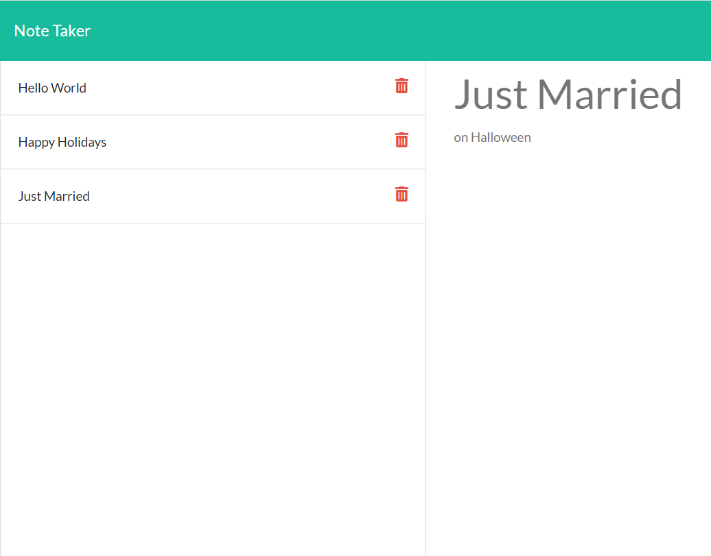
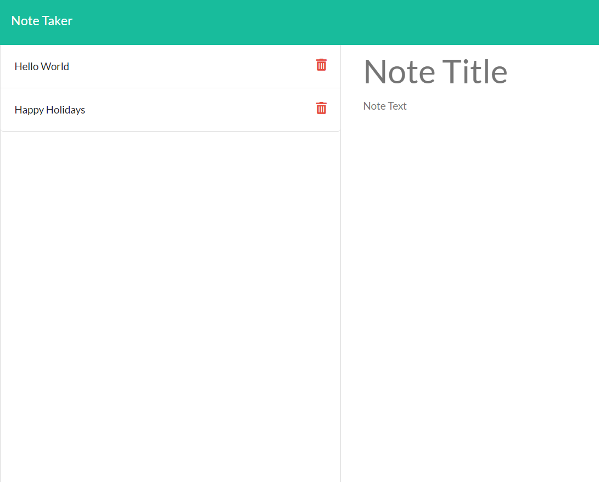

# express-note-taker
Homework Week 11

## Table of Contents

1. Installation
2. Usage
3. Images
4. Credits
5. License
6. URL 

## Installation

Clone with SSH Key:
git@github.com:cwf1984/express-note-taker.git

Or use the URL listed below to pull up the live page on Heroku. 

## Usage

* On the homepage, users click "GetStarted" and are taken to a separate page to enter notes. 
* On the notes page, users enter a note and click the save button in the upper right corner. The note appears on the left side of the screen and is deleted with the trashcan button. 
* Users can also click the saved notes on the left and have it display their text in the center of the page. 

## Images

Below is an image of several notes that have been saved and can be read once clicked:

Below is an image demonstrating that the last note has been deleted.

## Credits

As I have said with each preceding homework assignment, I want to thank Bootcamp Spot, the University of Washington and Trilogy Eduction for the assignment and code they provided. This assignment was challenging, but luckily with help I completed it. Thank you to the instructor and TA's for their dedication, patience and help. I also want to give thanks to my tutor, Zach Auerbach, for his help.

## License

MIT License

Copyright (c) [2020] [Vanessa B]

Permission is hereby granted, free of charge, to any person obtaining a copy
of this software and associated documentation files (the "Software"), to deal
in the Software without restriction, including without limitation the rights
to use, copy, modify, merge, publish, distribute, sublicense, and/or sell
copies of the Software, and to permit persons to whom the Software is
furnished to do so, subject to the following conditions:

The above copyright notice and this permission notice shall be included in all
copies or substantial portions of the Software.

THE SOFTWARE IS PROVIDED "AS IS", WITHOUT WARRANTY OF ANY KIND, EXPRESS OR
IMPLIED, INCLUDING BUT NOT LIMITED TO THE WARRANTIES OF MERCHANTABILITY,
FITNESS FOR A PARTICULAR PURPOSE AND NONINFRINGEMENT. IN NO EVENT SHALL THE
AUTHORS OR COPYRIGHT HOLDERS BE LIABLE FOR ANY CLAIM, DAMAGES OR OTHER
LIABILITY, WHETHER IN AN ACTION OF CONTRACT, TORT OR OTHERWISE, ARISING FROM,
OUT OF OR IN CONNECTION WITH THE SOFTWARE OR THE USE OR OTHER DEALINGS IN THE
SOFTWARE.

## URL
https://infinite-refuge-08662.herokuapp.com/